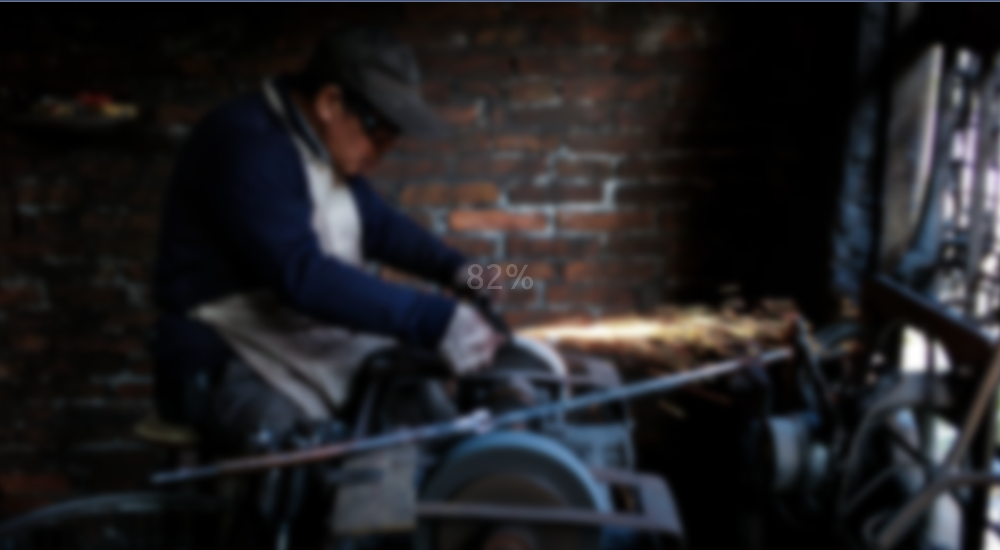

# 50 Projects in 50 Days - Blurry Loading

This is a code along project in the [50 Projects In 50 Days - HTML, CSS & JavaScript Udemy Course](https://www.udemy.com/course/50-projects-50-days/). Sharpen your skills by building 50 quick, unique & fun mini projects.

## Table of contents 😌

- [Overview](#overview)
  - [The project](#the-project)
  - [Screenshot](#screenshot)
  - [Links](#links)
- [My process](#my-process)
  - [Built with](#built-with)
  - [What I learned](#what-i-learned)
  - [Continued development](#continued-development)
  - [Code snippets](#im-really-proud-of-these-code-snippets%EF%B8%8F)
  - [Useful resources](#useful-resources)
- [Author](#author)
- [Acknowledgments](#acknowledgments)

## Overview👋🏾

Welcome to the fifth mini-project of the course!

### The project😥

In this project users will be able to:

- Build a responsive site that displays a loading text as well as blurs the background while loading.

### Screenshot🌇



### Links👩🏾‍💻

- Solution URL: (https://github.com/MaianneThornton/50in50_BlurryLoading)
- Live Site URL: (https://frolicking-biscotti-f94d2f.netlify.app/)

## My process💭

This is a simple project that I started by marking out initial classes in the html file to be later used for styling. Next I began styling the css by styling the background and loading text. I then added functionality by way of JavaScript to countdown the loading percentage, while blurring that text down to zero. I also added functionality by adding a blur on the background image starting at fully opaque and slowly increasing its visibility.

### Built with👷🏾‍♀️

- Semantic HTML5 markup
- CSS custom properties
- Flexbox
- JavaScript

### What I learned👩🏾‍🏫

I learned the logic behind making a functional blurry loading page. I will be applying this to future projects where needed.

I learned that opacity is a scale from 0 (not opaque) to 1 (opaque).

I also learned how to map a range of numbers to another range of numbers. (See [Useful Resources](#useful-resources) section)

### Continued development🔮

In the future I plan on continuing to practice positioning elements using flexbox, and using different selectors such as nth of type to select elements.

I also plan on continuing to learn the best ways to phrase git commits, so that future viewers can fully understand the changes that have occurred.

### I'm really proud of these code snippets✂️

```css
.bg {
  background: url('https://images.unsplash.com/photo-1576161787924-01bb08dad4a4?ixlib=rb-1.2.1&ixid=eyJhcHBfaWQiOjEyMDd9&auto=format&fit=crop&w=2104&q=80')
    no-repeat center center/cover;
  position: absolute;
  /* Prevents extra blurry edges from showing */
  top: -30px;
  left: -30px;
  width: calc(100vw + 60px);
  height: calc(100vh + 60px);
  z-index: -1;
  filter: blur(0px);
```

```js
function blurring() {
  load++

  // Stops running when int = 100
  if (load > 99) {
    clearInterval(int)
  }

  loadText.innerText = `${load}%`
  // Opacity is a scale from 0 (not opaque) to 1 (opaque)
  // Fades out the loading percentage text
  loadText.style.opacity = scale(load, 0, 100, 1, 0)
  // Fades out the bg image blur from 30px to 0px
  bg.style.filter = `blur(${scale(load, 0, 100, 30, 0)}px)`
}

// https://stackoverflow.com/questions/10756313/javascript-jquery-map-a-range-of-numbers-to-another-range-of-numbers
const scale = (num, in_min, in_max, out_min, out_max) => {
  return ((num - in_min) * (out_max - out_min)) / (in_max - in_min) + out_min
}
```

### Useful resources📖

- [Resource 1](https://stackoverflow.com/questions/10756313/javascript-jquery-map-a-range-of-numbers-to-another-range-of-numbers) - This is an amazing stack overflow post which helped to determine how to program the opacity of the loading percent text. Using this post I was easily able to map the loading percentage (0 - 100) to the opacity (0 - 1).
- [Resource 2](https://www.freecodecamp.org/news/how-to-write-better-git-commit-messages/) - This is an amazing article which helped me write better commit messages. I'd recommend it to anyone still learning this concept.


## Author🔎

- Website - [Portfolio Site](https://www.maiannethornton.com/Portfolio/index.html)
- Frontend Mentor - [@MaianneThornton](https://www.frontendmentor.io/profile/MaianneThornton)
- GitHub - [@MaianneThornton](GitHub.com/MaianneThornton)
- Twitter - [@MaianneThornton](https://twitter.com/MaianneThornton)
- LinkedIn - [@MaianneThornton](https://www.linkedin.com/in/maiannethornton/)

## Acknowledgments🙏🏾

Special Thanks go to [Brad Traversy](http://www.traversymedia.com/) and [Florin Pop](http://www.florin-pop.com/) creating the course and making reviewing concepts fun 😊.
